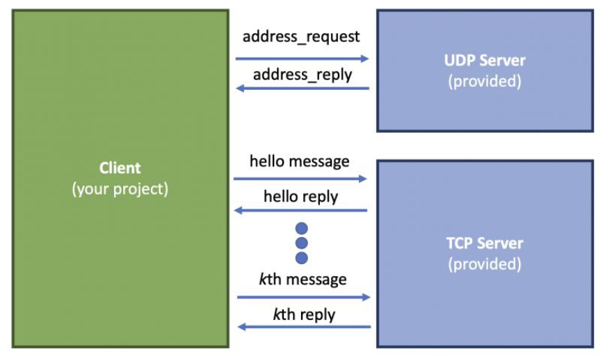
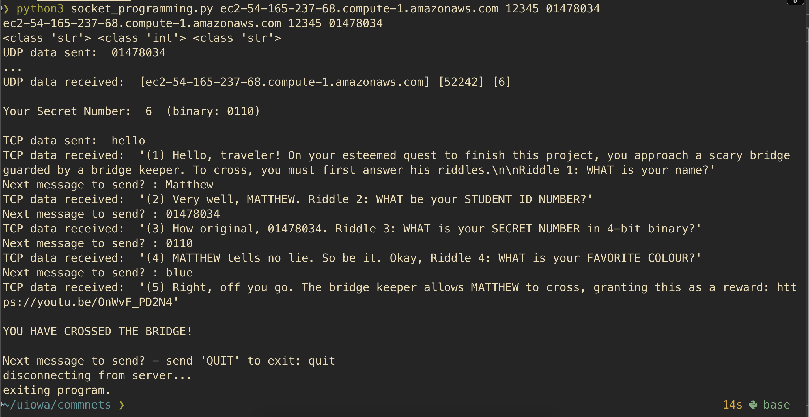

# Socket Programming Project



## Project Description

A Python client that communicates with both UDP and TCP servers. The client first contacts a UDP server to get connection details for a TCP server, then establishes a conversation with the TCP server.

## Usage

```
python client.py [UDPServerHostName] [UDPServerPort] [StudentID]
```

## How It Works

### UDP Phase
- Sends student ID to UDP server
- Receives TCP server hostname, port, and secret number
- Displays sent and received data

### TCP Phase
- Connects to TCP server using received information
- Sends "hello" and displays server response
- Prompts user for messages to send
- Continues conversation until "quit" is entered
- Displays all sent and received messages

## Project Output



## Source Code
- [socket_programming.py](socket_programming.py)
